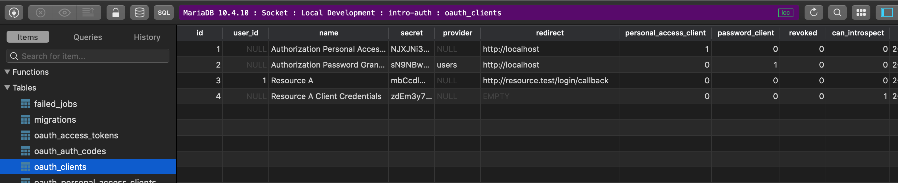

# Configuration

## Overview

To configure introspection, you will need to:

1. [ ] Register the introspection routes
2. [ ] Add the `getIntrospectionId()` method on your `User` model
3. [ ] Define ”trusted” OAuth Clients that can perform introspection

## Register the Routes

In your `App\Providers\AuthServiceProvider.php`, call the `Introspection::routes` method after the `Passport::routes` call:

```php
<?php

use DataHiveDevelopment\PassportIntrospectionServer\Introspection;
// ...
public function boot()
{
    $this->registerPolicies();

    Passport::routes();

    Introspection::routes();
}
```

## Identify Users

As stated earlier, you should have a unique identifier that you can use to identiy users across services. Whether that is email \(not recommended\) or a UUID \(recommended\), you need to inform the Introspection server so it can return the right user in the introspection response for the Introspection Client.

In your `User` model, add the following method:

```php
/**
 * Return the attribute value that represents the users global ID to the resource servers.
 *
 * @return string
 */
public function getIntrospectionId()
{
    return $this->uuid;
}
```

The method should return the value of the appropriate attribute. In the above example, we are using a `UUID` column.

## OAuth Clients for Introspection

As a security feature, the OAuth Introspection spec encourages protecting who can perform introspection as it can reveal sensitive details about your users or your system.

The Introspection Server package has this enforcement via either a database value or via a model method. The model method will override the database if both are defined.

### Database Column \(Recommended\) <a id="database-column"></a>

The Introspection Server package includes a database migration that adds a `can_introspect` boolean column to the `oauth_clients` table from Passport.

At this time, you will need to manually update the value in the database after creating the client for your resource server\(s\). You can read more about this process on the [Usage](../introspection-client/usage.md#client-credentials-grant) page.



### Client Model

If you can’t or don’t want to use the database, you can use a custom Passport Client model.

Create a new model and extend `Laravel\Passport\Client`. [This section](https://laravel.com/docs/passport#overriding-default-models) of the Passport documentation outlines that process.

Next, add a `canIntrospect()` method to the model and define your criteria. The method must only return a boolean true or false.

```php
/**
 * Determine if this client is allowed to request token introspection.
 *
 * @return boolean
 */
public function canIntrospect()
{
    return ($this->name === 'My Resource Server');
}
```

The Introspection Server will automatically pick up the custom Client model registered with Passport and use it when looking for the method.

## Configuration

While not having a config file of it's own, this package does have some options you can configure using methods.

### Migrations

If you want to disable the included migration, you can call the `Introspection::ignoreMigrations` method in the `register` method of your `AppServiceProvider`. You can export the default migrations using `php artisan vendor:publish --tag=introspection-server-migrations`.

```php
<?php

namespace App\Providers;

use Illuminate\Support\ServiceProvider;
use DataHiveDevelopment\PassportIntrospectionServer\Introspection;

class AppServiceProvider extends ServiceProvider
{
    /**
     * Register any application services.
     *
     * @return void
     */
    public function register()
    {
        Introspection::ignoreMigrations();
    }
```

### Routes

The Introspection Server offers one route that is used by the client package, this is the `introspect` route and it is responsible for all the heavy lifting.

By default, the route is registered at the `/oauth/introspect` URL and utilizes [Passport's Client](https://laravel.com/docs/passport#client-credentials-grant-tokens) middleware. You can change the route prefix or middleware by passing an array to the `Introspection::route` method in your `AuthSerivceProvider`. You can override none, one or both options.

```php
public function boot()
{
    $this->registerPolicies();

    Passport::routes();

    Passport::tokensCan([
        'user.read' => 'Read user profile.',
        'messages.read' => 'Read user messages.',
    ]);
    
    // Other Passport options

    Introspection::routes([
        'middleware' => 'client,scope:introspect',
        'prefix' => 'api'
    ]);
}
```

