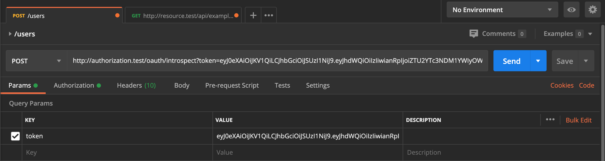
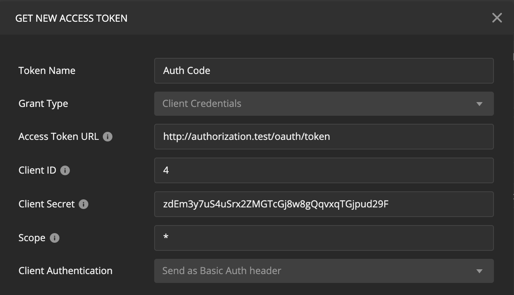

# Troubleshooting

## Testing The Introspection Endpoint

You can manually test the introspection endpoint on your authorization server using tools such as [Postman](https://www.postman.com/).

## Using Postman

Postman is a fantastic API software development tool. It enables you to test calls to APIs and see the responses. It supports most of the common OAuth flows and allows you to manipulate and define every aspect of an HTTP request.

Postman is free but does offer some paid plans for larger teams. Check them out over at [https://www.postman.com/](https://www.postman.com/).

Enter the introspection endpoint as a POST request type: `http://authorization.test/oauth/introspect`

Under the "Params" tab, add a key-value pair with the key of `token` and a value being the bearer token belonging to a user requested via standard authorization code grant flow in Passport.



Under the "Authorization" tab, you will need to obtain a client credentials grant token. Select "OAuth 2.0" from the type dropdown, "Add authorization data to" should be set to "Request Headers" by default.

Click "Get New Access Token" and set the following options \(updating the URLs to match your environment as necessary\):

* Grant Type: Client Credentials
* Access Token URL: http://authorization.test/oauth/token
* Client ID: {The OAuth Client ID for your resource server's client credentials grant}
* Client Secret: {The OAuth Client Secret for your resource server's client credentials grant}
* Scope: \*
  * If you are using scope middleware on the Introspection endpoint on your authorization server, use those here instead of an asterisk.

Clicking "Request Token" should return a new token. Click "Use Token" to continue.




If you receive an error or nothing happens, you can view the Passport console under View &gt; Show Postman Console.


Click "Send" next to the URL to make the introspection request. 



Introspection Endpoint



Accepts an OAuth token and returns information on it’s validity and the associated user.






The OAuth token that you want to introspect.







A successful introspection request will return a JSON string representing data from the token and the associated user’s unique identifier \(this is the value of the attribute returned by getIntrospectionId\(\) on the Introspection Server\).  
  
A 200 response will be returned in all other instances except for authorization exceptions.


```javascript
{
    "active": true,
    "scope": "user.read messages.read",
    "client_id": 3,
    "token_type": "access_token",
    "exp": 1624847526,
    "iat": 1593311526,
    "nbf": 1593311526,
    "sub": 1,
    "aud": 3,
    "jti": "e56a77435ab29d0834eee2ef0185fc708e34d77ba7603e6d60f3e40de4f04dda2f9e9781ac389bd9",
    "id": "87f96b2f-bb5d-446a-8fce-b37a9508561b"
}
```




If the OAuth token passed in the Authorization header is invalid, expired or otherwise unusable, an unauthorized response will be returned with nothing else.


```
Unauthorized
```




If the client requesting introspection is not allowed to do so, a 403: Forbidden response code will be returned along with an unauthorized error.


```
Unauthorized
```






